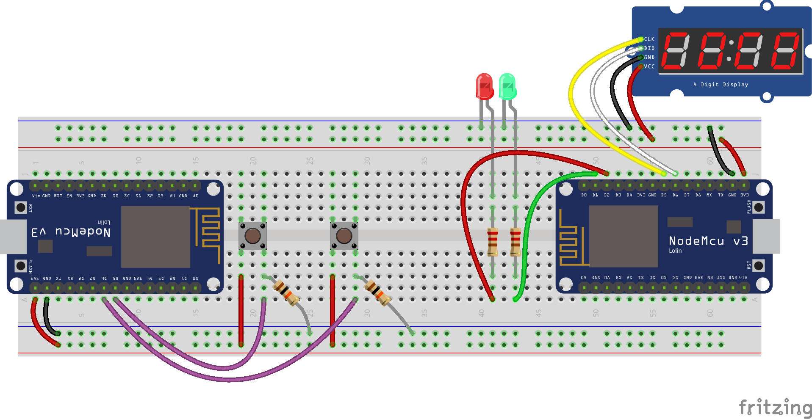
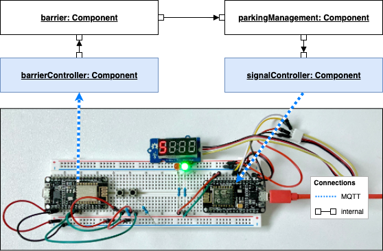
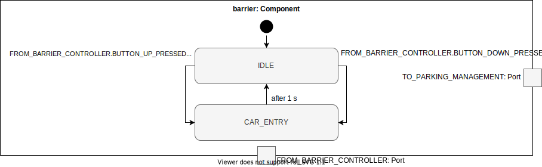

# MVP Testbed

## SORRIR MVP

This project demonstrates how to set up a testbed using the SORRIR framework. We will use the SORRIR framework to process and control the behavior of two microcontrollers (ESP8266) connected via MQTT to our application to simulate a parking garage. 

One microcontroller is used to simulate the barrier of a parking garage. The other microcontroller displays the status of the parking garage (free/not-free, number of remaining free parking spaces).

The application logic is realised with the SORRIR framework. The microcontrollers only receive or send MQTT messages. Apart from the MQTT handling, they do not have any application logic.

## Requirements

**Hardware**

* 2x ESP8266 dev board (if possible buy v2 instead of v3), buy from [AliExpress (China)](https://de.aliexpress.com/item/32665100123.html) or [Amazon](https://www.amazon.de/AZDelivery-NodeMCU-ESP8266-ESP-12E-Development/dp/B0754HWZSQ/) 
* 1x red + 1x green LED and corresponding resistors (around 220 Ohm)
* 2x buttons and corresponding resistors (around 10 kOhm)
* Breadboard
* Jumper wires

**Infrastructure**

* Access to a WiFi network (required for the microcontrollers)
* MQTT broker
* Computer that can run the application logic


## Hardware



Microcontroller one named `buttonMcu` (left) is used to simulate the barrier of a parking garage. Two buttons are connected to `buttonMcu` to simulate a car enters or leaves the garage by pushing a corresponding button.

The other microcontroller `signalMcu` (right) is used to visualise the status of the parking garage. A small display shows the remaining free parking spaces. Additionally, a green LED lights up when there a free spaces remaining, otherwise a red LED lights up to indicate that there is no free space.

You can use the wiring diagram you can [download here](fritzing/Wiring.fz.fzz) to set up your hardware. To open the diagram you need [Fritzing](https://fritzing.org/home/).

## Software

In the following we will explain the main concepts of the SORRIR framework by a step-by-step walkthrough.

### Preparations

If this is your first TypeScript project, you may need to [install nodejs](https://nodejs.org/en/download/package-manager/) and an IDE of your choice, e.g., [WebStorm](https://www.jetbrains.com/de-de/webstorm/), [VSCode](https://code.visualstudio.com/), or [VSCodium](https://vscodium.com/) (same as VSCode but without all the Microsoft tracking crap).

Clone the projects containing the SORRIR framework [mvp](https://gitlab-vs.informatik.uni-ulm.de/sorrir/mvp) and the [testbed](https://gitlab-vs.informatik.uni-ulm.de/sorrir/mvp-simple-testbed) into a directory of your choice, e.g. *sorrir/*.

Inside *sorrir/mvp-testbed/*, open *tsconfig.json*. The testbed project locally imports the SORRIR framework as a [symlink](https://docs.npmjs.com/cli/link) (see last line). Because of this, it is necessary to build the framework first. Run from your command line `npm run-script build-framework`. You have to do this only once or after you made changes to the framework project.

```json
{
  "name": "mvp-simple-testbed",
  "version": "0.1.0",
  "description": "",
  "main": "app.ts",
  "scripts": {
    "build": "tsc",
    "start": "tsc && node dist/app.js",
    "build-framework": "cd ../mvp && npm run-script build"
  },
  "dependencies": {
    "tslint": "^6.1.0",
    "typescript": "^3.8.3",
    "@types/node": "^12.12.34",
    "sorrir-framework": "file:../mvp"
  }
}

```
*Content of package.json*

**NEW:** if you do not plan to contribute to the development of the SORRIR framework, you can easily import the framework via npm, too. Therefore, add `"sorrir-framework": "^0.3.4"` to the dependencies section of your *package.json*.

Finally, install dependencies of the testbed project: `npm install`.

### SORRIR Framework Overview

From the top level view, your application consists of components. To communicate or to be more precise send events from one component to another component, components can be connected through ports.

The internal behavior of a component is defined by a state machine. In consequence, each component has several states and transitions.

The internal engine executes the behavior in step-wise. In every step, each component is executed once. Resulting events will be delivered in the next step.

### Testbed Overview



The testbed consists of two components `barrier` and `parkingManagement`. The former just acts as a relay from the MQTT component to the `parkingManagement` for button pressed events. The latter controls the red and green led as well as the digit display depending on the available spaces in the parking garage.

The MQTT components – highlighted blue – are special kinds of *I/O components* provided by the SORRIR framework. We will come to this later.

## Framework

We start building our testbed by specifying the `barrier` component step-by-step followed by specifying `parkingManagement` component. Furthermore, we explain how to integrate MQTT I/O components.

### Components



To create a new component, you have to describe its states, the external events it can handle, the ports through which it can be connected to other components, its internal state, and a state machine to describe its behavior.

#### States

`barrier` has two states `IDLE` and `CAR_ENTRY`. Define the state of a component within its `*.ts` file – in this case `Barrier.ts`.

```typescript
enum BarrierStates {
    IDLE = "IDLE",
    CAR_ENTRY = "CAR_ENTRY"
}
```

#### Ports

Since ports are used to connect a component to another component, it is a good naming pattern to start the name of port with its direction followed by the target or target group. Events can be sent and received only to components that are connected to a component.

> In the current version of the SORRIR framework prototype a port's direction is just a naming convention. It is possible to send an event through port `FROM_MY_COMPONENT` whereas its name would indicate the other way round. In a future version, we will ensure a correct behavior within the framework.

`barrier` is connected to `barrierController` via port `FROM_BARRIER_CONTROLLER` and to `parkingManagement` via port `TO_PARKING_MANAGEMENT`. You have to define the ports of a controller as an enum:

```typescript
export enum BarrierPorts {
    TO_PARKING_MANAGEMENT = "TO_PARKING_MANAGEMENT",
    FROM_BARRIER_CONTROLLER = "FROM_BARRIER_CONTROLLER"
}
```

#### Events

Since events are sent across various components of your application, their types should be defined in a central file `events.ts`. Event types must be defined as an *enum*:

```typescript
export enum EventTypes {
    BUTTON_UP_PRESSED = "BUTTON_UP_PRESSED",
    BUTTON_DOWN_PRESSED = "BUTTON_DOWN_PRESSED",
    CAR_IN = "CAR_IN",
    CAR_OUT = "CAR_OUT",
    LED_RED = "LED_RED",
    LED_GREEN = "LED_GREEN",
    DISPLAY = "DISPLAY"
}
```

In this example, we use a single event enum for the whole application. If your application grows, you can think of splitting it into several more specific event enums.

The events that are passed from component to component or within a component are typed by the *EventTypes* you specified in your *enum*. This way a component can react depending on the type of the event it has received. In general, an *Event* looks like this:

```typescript
export interface Event<E, P, D> {
	readonly type: E,
	readonly port?: P,
	readonly payload?: D
}
```

If you do not specify a `port`, the event is an internal event of your component. Currently, `payload?` is optional and only used for MQTT events.

#### InternalState

A component also has an internal state that is passed from step to step. It should be *readonly* to remind you, that you can not change an internal state. During the execution of a step,

@todo mit matthias abklären, wie das nun eigentlich richtig ist

Define your internal state as a *type alias* containing all the attributes you need for your component:

```typescript
type BarrierState = {
    lastAction : number;
}
```

The internal state of `barrier` holds a single attribute `lastAction: number`. We use this attribute to save the last timestamp a car passed the barrier (or a button was pressed) to ensure that this can happen only once per second.

#### Behavior

You describe the behavior of a component as a state machine. You have to pass all the states, ports, event types, and the internal state you defined before as type parameter to the state machine:

```typescript
const sm : StateMachine<BarrierStates, BarrierState, EventTypes, BarrierPorts> = {
    transitions: [...]
};
```

How, when, and under what conditions the state machine can switch from a state to another state is expressed by a transition. The interface of a transition looks as follows:

```typescript
export interface Transition<F, M, E, P, D> {
	readonly sourceState: F,
	readonly event?: [E,P?],
	readonly condition?: (myState: M, event?:Event<E, P, D>) => Boolean,
	readonly action?: (myState: M, raiseEvent:RaiseEventCallBack<E, P, D>, event?: Event<E, P, D>) => M,
	readonly targetState: F,
}
```

As you can see, at least you have to define a source and a target state. You can react to a specific event (otherwise the transition is activated automatically). You also can define a *guard* (condition) which ensures that the transition is activated only if a user defined condition is satisfied. Furthermore, you can define an action function that is executed if the transition is activated. Within this action function, you can update the internal state of the state machine or raise new events.

As you can see in the overview image of `barrier` above, if it is in state `IDLE` and receives one of the events `BUTTON_UP_PRESSED` or `BUTTON_DOWN_PRESSED` via port `FROM_BARRIER_CONTROLLER` it should send `CAR_IN` or `CAR_OUT` correspondingly to `parkingManagement` via port `TO_PARKING_MANAGEMENT` and switch to state `CAR_ENTRY`. Let's see how this works by creating a new transition inside the state machine:

```typescript
...
transitions: [
	{
		sourceState: BarrierStates.IDLE,
	  	targetState: BarrierStates.CAR_ENTRY
	}
]
...
```

This is the most basic transition. To activate it only on event `BUTTON_DOWN_PRESSED` you have to add:

```typescript
{
	sourceState: BarrierStates.IDLE,
  	targetState: BarrierStates.CAR_ENTRY,
  	event: [EventTypes.BUTTON_DOWN_PRESSED, BarrierPorts.FROM_BARRIER_CONTROLLER]
}
```
Besides specifying the event that can activate that transition, you also have to define the port through which the event will be received. As you may noticed, you only can choose from events you have specified and passed as parameter to the state machine before.

To raise a new event, you can specify an action function:

```typescript
{
	...
	action: (myState, raiseEvent, event) => {
		raiseEvent({ type: EventTypes.CAR_OUT, port: BarrierPorts.TO_PARKING_MANAGEMENT});
		return { lastAction: Date.now() };
   }
	...
}
```
Your action function gets the internal state, `raiseEvent`, and the occurring event. `raiseEvent` is a callback function to raise a new event. It expects an `Event` as parameter. The interface of `Event` requires the attribute `type` and optional `port` and `payload` (see above). You can call `raiseEvent` as many times you need to.

The last line `{ lastAction: Date.now() }` updates the internal state by setting the current timestamp. We need this timestamp to simulate the time a car takes to pass the barrier. `barrier` should only switch back from `CAR_ENTRY` to `IDLE` after 1s. The corresponding transition looks as follows:

```typescript
{
            sourceState: BarrierStates.CAR_ENTRY,
            targetState: BarrierStates.IDLE,
            condition: myState => myState.lastAction + 1000 <= Date.now(),
            action: myState => {
					// action is actually not required
					return myState;
            }
}
```
The condition ensures that this transition can be activated only if the last action happened at least 1000 ms back in time.

During the time `barrier` is in `CAR_ENTRY`, all incoming button events will not be processed but stored and processed when `barrier` is switched back to `IDLE`.

To complete the definition of `barrier` you have to define a transition for event `BUTTON_UP_PRESSED` correspondingly to `BUTTON_DOWN_PRESSED`.

#### Component

Next, all things are grouped into a *Component*. Unfortunately, the current version of the framework requires all elements of the ports enum to be listed manually and passed as argument to `createStatemachineComponent(...)`. `sm` is the state machine you created before and `"barrier"` is the name of that component:

```typescript
export const barrier:Component<EventTypes, BarrierPorts> = createStatemachineComponent(
    [BarrierPorts.TO_PARKING_MANAGEMENT, BarrierPorts.FROM_BARRIER_CONTROLLER],
    sm,
    "barrier",
);
```

#### Initial State

Finally, you have to describe the initial state of your component. In our case the start state is set to `IDLE`, the internal state to `lastAction: 0` and we did not put any prepared event in the event queue. 


```typescript
export const barrier_startState:StateMachineState<BarrierStates, BarrierState, EventTypes, BarrierPorts> = {
    state: {
        fsm: BarrierStates.IDLE,
        my: {
            lastAction: 0
        }
    },
    events: []
};
```


#### Component parkingManagement


You can find `parkingManagement` inside `ParkingManagement.ts`. `parkingManagement` consist of the states `AVAILABLE` (there are free parking spaces in the parking garage) and `FULL` (no free parking spaces left). It is connected via port `FROM_BARRIER` to `barrier` and via port `TO_SIGNAL_CONTROLLER` to `signalController` I/O component.

On every transition this component sends three events to the `signalController`: *LED RED* on or off, *LED GREEN* on or off, and the remaining free parking spaces. Depending on the received car event from `barrier` the number of free parking spaces (stored in the internal state of `parkingManagement`) is in- or decreased. While there are free parking spaces left, `parkingManagement` stays in `AVAILABLE`. If there are no spaces left, it switches to `FULL`.

Regarding to the way MQTT works, we raise three single events for each of the hardware components we want to control:

```typescript
...
{
	sourceState: ParkingManagementStates.AVAILABLE,
	targetState: ParkingManagementStates.FULL,
	event: [EventTypes.CAR_IN, ParkingManagementPorts.FROM_BARRIER],
	condition: myState => myState.freeParkingSpaces - 1 == 0,
	action: (myState, raiseEvent) => {
		const updatedFreeParkingSpaces = myState.freeParkingSpaces-1;

		raiseEvent({type: EventTypes.LED_RED, port: ParkingManagementPorts.TO_SIGNAL_CONTROLLER, payload: {status: true}});
		raiseEvent({type: EventTypes.LED_GREEN, port: ParkingManagementPorts.TO_SIGNAL_CONTROLLER, payload: {status: false}});
		raiseEvent({type: EventTypes.DISPLAY, port: ParkingManagementPorts.TO_SIGNAL_CONTROLLER, payload: {freeSpaces: updatedFreeParkingSpaces}});

		return {
			freeParkingSpaces: updatedFreeParkingSpaces,
			totalParkingSpaces: myState.totalParkingSpaces
		};
	}
},
```
There is a small but important difference to the events we raised from `barrier`. This time, the raised events have a payload.

```typescript
raiseEvent({type: EventTypes.LED_GREEN, port: ParkingManagementPorts.TO_SIGNAL_CONTROLLER, payload: {status: false}});
```

To enable a state machine to handle events with a payload, you have to specify an additional payload type at the state machine definition (see last parameter):

```typescript
const sm : StateMachine<ParkingManagementStates, ParkingManagementState, EventTypes, ParkingManagementPorts, MQTTPublishPayload> =
{ ... }
```

You can specify any arbitrary data type or interface as payload. In our case, the payload looks like this:

```typescript
export interface MQTTPublishPayload {
    status? : boolean,
    freeSpaces? : number
}
```
The remaining things to do are similar to `barrier`.

In the next section, we describe how MQTT I/O components can be specified.

### MQTT Components

We use the MQTT protocol to communicate with the sensor nodes. MQTT follows the publish/subscribe pattern and is a lightweight machine-to-machine protocol for the Internet of Things.

There are two kinds of MQTT components which the SORRIR framework offers out-of-the-box. A *MQTTReceiveComponent* and a *MQTTSendComponent*. Both MQTT components of our testbed are declared in  `MQTTComponents.ts` and are described in the following.

MQTT requires a MQTT broker. You can run a broker at your own, for example [Mosquitto](https://mosquitto.org/), or use one that is public available, e.g., `mqtt://test.mosquitto.org`. Whatever you decide to do, you must add your MQTT credentials to `params.ts`:

```typescript
export const params = {
	...
    mqttURL:                "mqtt://hassio.local",      // URL of your MQTT broker
    mqttUser:               "mqtt",                     // username and password for MQTT broker if needed
    mqttPw:                 "top-secret",     			// otherwise leave empty
	...    
}
```
In consequence, during the start of your application each MQTT component connects to the MQTT broker what could take some time.

#### BarrierController

Since MQTT components are just components as the two components described before, you need to define ports to connect them with other components. This is done in our case in `MQTTPorts.ts`:

```typescript
export enum barrierControllerPorts {
    TO_BARRIER = "TO_BARRIER"
}
```

You do not need to explicitly specify a behavior via a state machine for a MQTT receive component. On every MQTT message the component receives, it calls your decode function (see below). If your function returns an event, the component will send it through the specified port.

You only need create the component by calling

```typescript
export const barrierController = createMQTTReceiveComponent(mqttBarrierControllerName, barrierControllerPorts.TO_BARRIER);
```

In contrast to a regular component you even do not need to create a start state by hand, instead, call `createMQTTReceiveComponentState(...)` with the following parameters:

* `name:string` the MQTT receiver will subscribe to a topic named like that. In our example, we set the topic to `sorrir/button-pressed`. Be careful: currently you have to ensure by hand that this topic is the same as you specified on the microcontroller.
* `brokerUrl: string` url of your MQTT broker.
* `opts?: IClientOptions` is taken by the underlying MQTT library. In our case, we specify username, password, and clientId. For all possible attributes, we refer to the official [documentation of MQTT.js](https://github.com/mqttjs/MQTT.js#client).
* `decode? : (mqttPayload: string) => Event<E, P, D> | undefined` is the function you have to write to decode the MQTT payload into a corresponding event of your application. Microcontroller `buttonMcu` (the one with the buttons connected to) sends to the topic you defined either payload `BUTTON_UP_PRESSED` or `BUTTON_DOWN_PRESSED` regarding the pressed button. In consequence, the resulting decode function is:

```typescript
const decode = (payload: string) => {
    if (payload === "BUTTON_UP_PRESSED" || payload === "BUTTON_DOWN_PRESSED") {
        return {port: barrierControllerPorts.TO_BARRIER, type: payload };
    }
}
```

The full call to create a MQTT receive component looks as follows:

```typescript
const opts = { username: params.mqttUser, password: params.mqttPw};

export const barrierController = createMQTTReceiveComponent(mqttBarrierControllerName, barrierControllerPorts.TO_BARRIER);
export const barrierControllerState = createMQTTReceiveComponentState(mqttButtonTopic, params.mqttURL, {...opts, clientId: mqttBarrierControllerName}, decode);
```


#### SignalController

Similar to `barrierController` the MQTT publisher `signalController` requires ports:

```typescript
export enum signalControllerPorts {
    FROM_PARKING_MANAGEMENT = "FROM_PARKING_MANAGEMENT"
}
```

Instead of writing a decode function, you need to write an encode function. For this it is important to know, how MQTT works: instead of sending a big JSON encoded payload to your microcontroller, you send single commands on different subtopics each for every connected hardware component. In our example, we connected a green LED, a red LED, and a digit display to the microcontroller. In consequence the following (sub)topics emerge:

* `sorrir/signal-update/LED_RED` with payload `0` or `1`.
* `sorrir/signal-update/LED_GREEN` with payload `0` or `1`.
* `sorrir/signal-update/DISPLAY` with any number as payload.

The encode function is defined by `encode?: (event: Event<E, P, D>) => [string, string]`. The first string of the tuple your encode function has to return is the subtopic on which you want to publish a payload (the second element).

In our case, the encode function is:

```typescript
const encode = (event : Event<EventTypes, any, MQTTPublishPayload>) : [string, string] | undefined => {
    switch (event.type) {
        case EventTypes.LED_GREEN:
        case EventTypes.LED_RED:      return [event.type.valueOf(), event.payload?.status ? "1" : "0"];

        case EventTypes.DISPLAY:      return [event.type.valueOf(), event.payload?.freeSpaces ? event.payload?.freeSpaces.toString() : "0"];
        default:                      return undefined;
    }
}
```

Do you remember how we raised events within the `signalController` component?

```typescript
raiseEvent({type: EventTypes.LED_RED, port: ParkingManagementPorts.TO_SIGNAL_CONTROLLER, payload: {status: false}});
```

Your encode function must be able to handle payload the payload of an event you send from an other component to the MQTT publisher. This is ensured by setting the same type parameter `MQTTPublishPayload`

```typescript
const encode = (event : Event<any, any, MQTTPublishPayload>)
```

as the connected component

```typescript
const sm : StateMachine<ParkingManagementStates, ParkingManagementState, EventTypes, ParkingManagementPorts, MQTTPublishPayload> = {
```

The MQTT send component will append your subtopic to the topic you prior defined in:

```typescript
export const signalControllerState = createMQTTSendComponentState(mqttSignalTopic, params.mqttURL, {...opts, clientId: mqttSignalControllerName}, encode);
```

In our case, we set the topic to `sorrir/signal-update`.

### Bringing it all together

After we specified each component, we need to connect them with each other. Therefore, open `app.ts`. Connections are made within a *Configuration*. *Configuration* requires two attributes:

* `components` an array that must contain all the components of your application
* `connections` an array holding all the connections of your application. To create a connection, you have to call `createConnection` with the following parameters:
	* `sourceComponent`
	* `sourcePort` port of the source component
	* `targetComponent`
	* `targetPort` port of the target component

In our case, the *Configuration* looks like:

```typescript
const config:Configuration = {
  components: [barrier, parkingManagement, barrierController, signalController],
  connections: [
      createConnection(barrierController, barrierControllerPorts.TO_BARRIER, barrier, BarrierPorts.FROM_BARRIER_CONTROLLER),
      createConnection(barrier, BarrierPorts.TO_PARKING_MANAGEMENT, parkingManagement, ParkingManagementPorts.FROM_BARRIER),
      createConnection(parkingManagement, ParkingManagementPorts.TO_SIGNAL_CONTROLLER, signalController, signalControllerPorts.FROM_PARKING_MANAGEMENT)
  ]
};
```

Next, you have to set every component its initial state:

```typescript
let confState = {
  componentState: new Map([
      [barrierController, barrierControllerState] as [any, any],
      [barrier, barrier_startState] as [any, any],
      [parkingManagement, parkingManagement_startState] as [any, any],
      [signalController, signalControllerState] as [any, any]
  ])
};
```

In general, `confState` (or however you like to name this variable) holds the current state of your application.

### Run your appliaction

To execute your application, you must call:

```typescript
confState = configurationStep(config, confState);
```

This would execute your application once or in other words execute one single step. To run your application until you stop it, you can do:

```typescript
setInterval(args => {
    confState = configurationStep(config, confState);
}, params.tickRateInMilliSec);
```

In our case `tickRateInMilliSec`is set to 500 (ms) within `params.ts`.

Remember that it can take some time during start up until your MQTT components are connected to the MQTT broker. Your application only starts running when all MQTT components are connected.

## Embedded Software

Out of scope of the SORRIR project but required to run a demonstrator is the software running on the microcontrollers to handle the MQTT messages. In the current version, on microcontroller `buttonMcu` we run [ESPMega](https://www.letscontrolit.com/wiki/index.php/ESPEasyMega). On microcontroller `signalMcu` (LEDs and display) we run the more advanced but easier to use and integrate [ESPHome](https://esphome.io/). You can find an instruction how to install ESPHome on your machine [here](https://esphome.io/guides/getting_started_command_line.html#installation). Actually, ESPHome is made to easily integrate arbitrary sensor nodes into the open-source smart home software [Home Assistant](https://www.home-assistant.io/) but you can use ESPHome without Home Assistant as we do.

ESPHome takes a configuration file, generates C++ code from it, and deploys it to your sensor node either via cable or WiFi. The configuration file for microcontroller two can be found [here](src/espConfig/receiver.yaml). We will migrate microcontroller one from ESPMega to ESPHome soon and will add the config file as well.